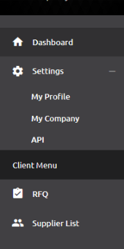
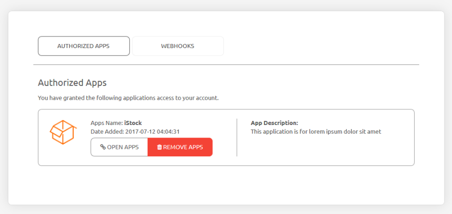
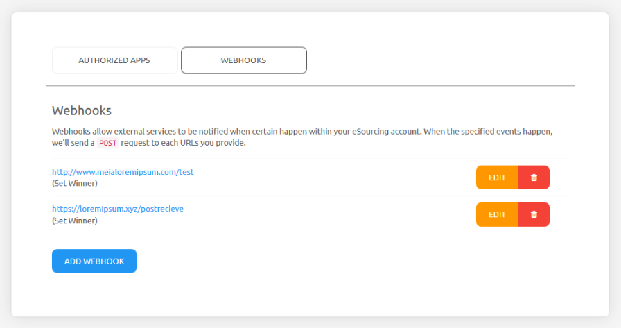
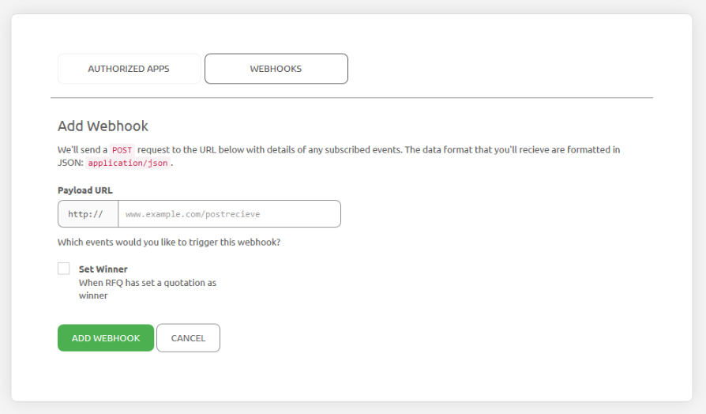
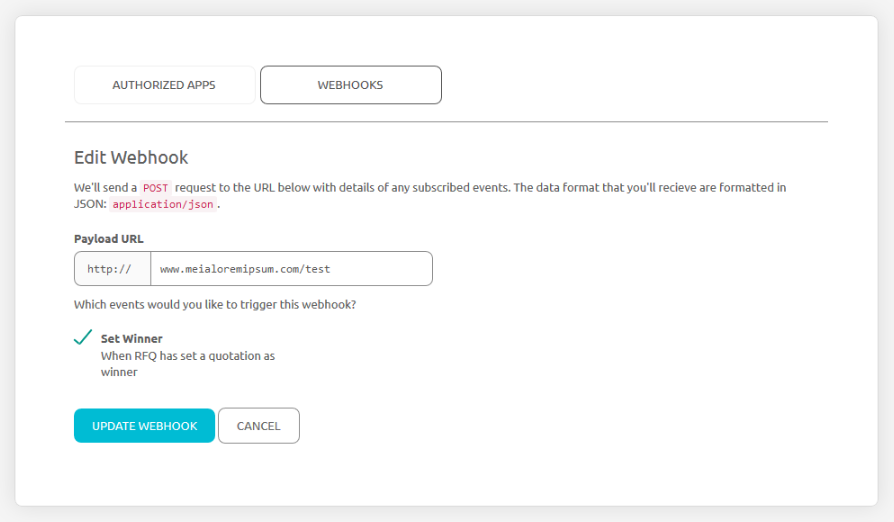
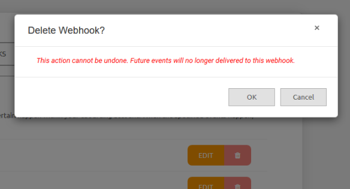

Webhooks
========

Webhooks allow external services to be notified when certain happen within your eSourcing account. When the specified events happen, we'll send a POST request to each URLs you provide.

Open webhook Page
-----------------

To access webhook page, go to the menu - click Settings and choose API.

After API page has been opened, click the Webhooks tab.

Webhooks List
-------------

Webhooks list will be showed on the webhook tab

the webhook list contains the webhook URLs, the trigger events, edit and delete button for each webhook.

Add Webhook
+++++++++++

To add a new webhook, click the 'Add Webhook' button inthe bottom and the form will be appeared:

- Payload URL - Choose the HTTP type (HTTP:// or HTTPS://), and input the URL

- trigger events - Choose the events that you like trigger the webhook.

- Click Add Webhook button to add webhook or click Cancel button to discard the form.

Edit Webhook
++++++++++++

To make any changes to current webhook, click the 'Edit' button inthe bottom and the form will be appeared:

- Payload URL - Choose the HTTP type (HTTP:// or HTTPS://), and input the URL

- trigger events - Choose the events that you like trigger the webhook.

- Click Update Webhook button to save or click Cancel button to discard any changes.

Delete Webhook
++++++++++++++

To delete current webhook, click the 'Delete' button, and the confirmation popup will be appear.

Click OK to continue; please note that delete webhook cannot be undone and will be premanently removed.