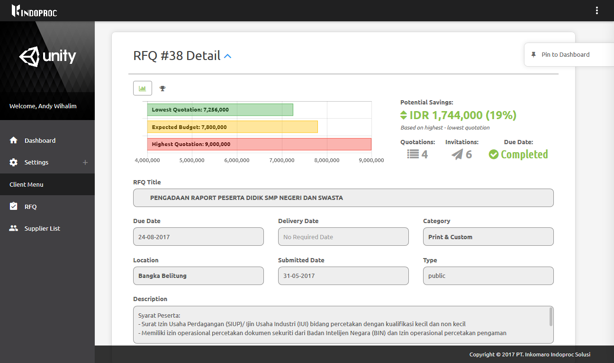
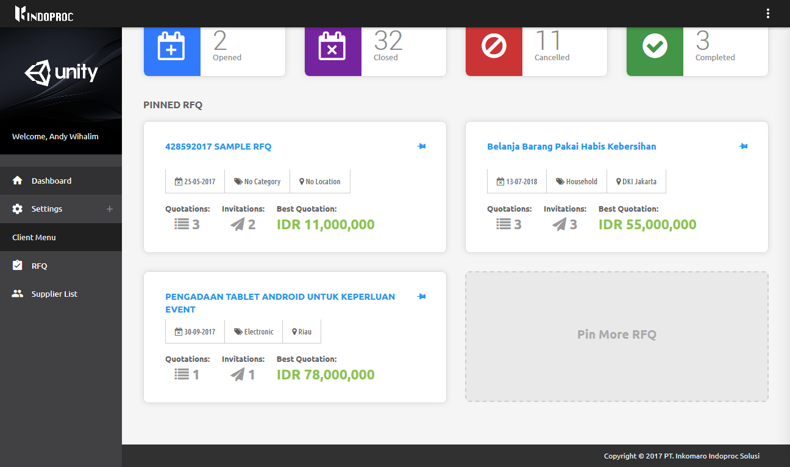

Pin an RFQ into Dashboard
=========================

You can quick-access your RFQs by pinning the into the dashboard.

To pin your RFQ, open the detail page of your RFQ and tap the 'Pin to Dashboard' button on the floating bar in the right side of your screen.

Pinned RFQ will be appeared on the dashboard.
	
