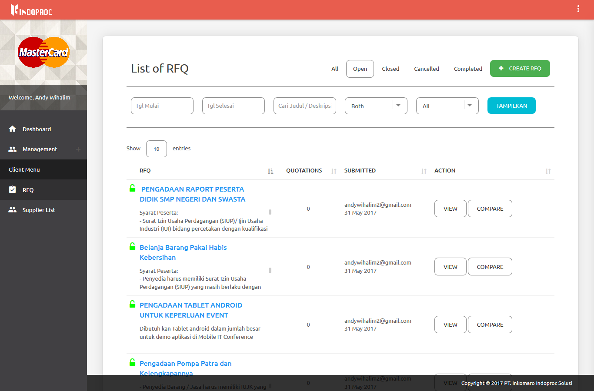
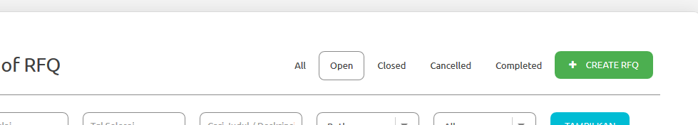
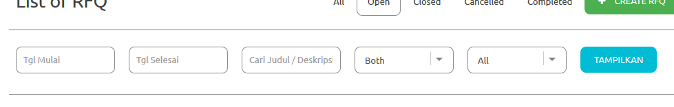
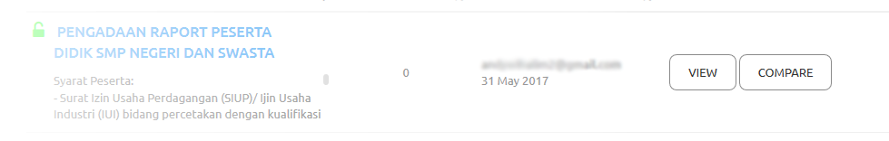
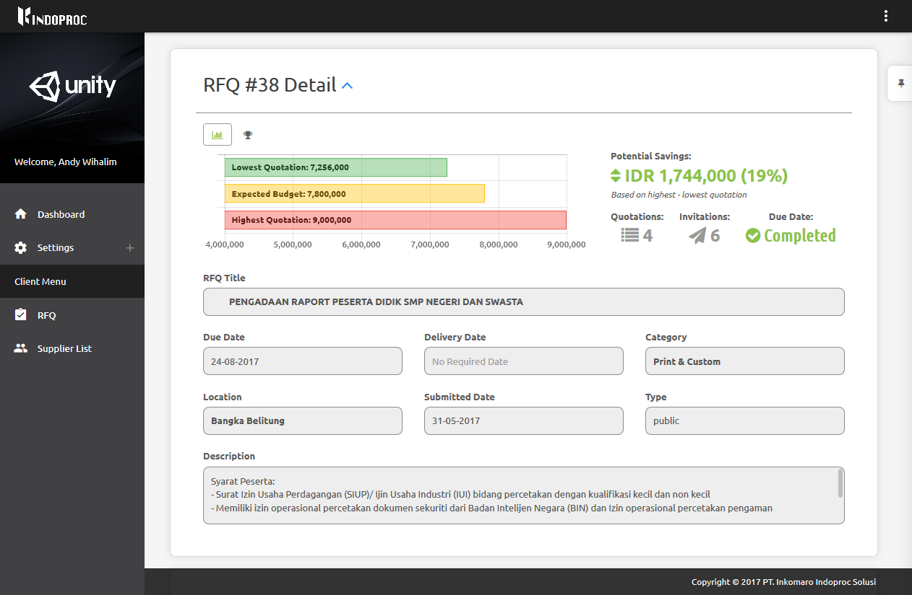
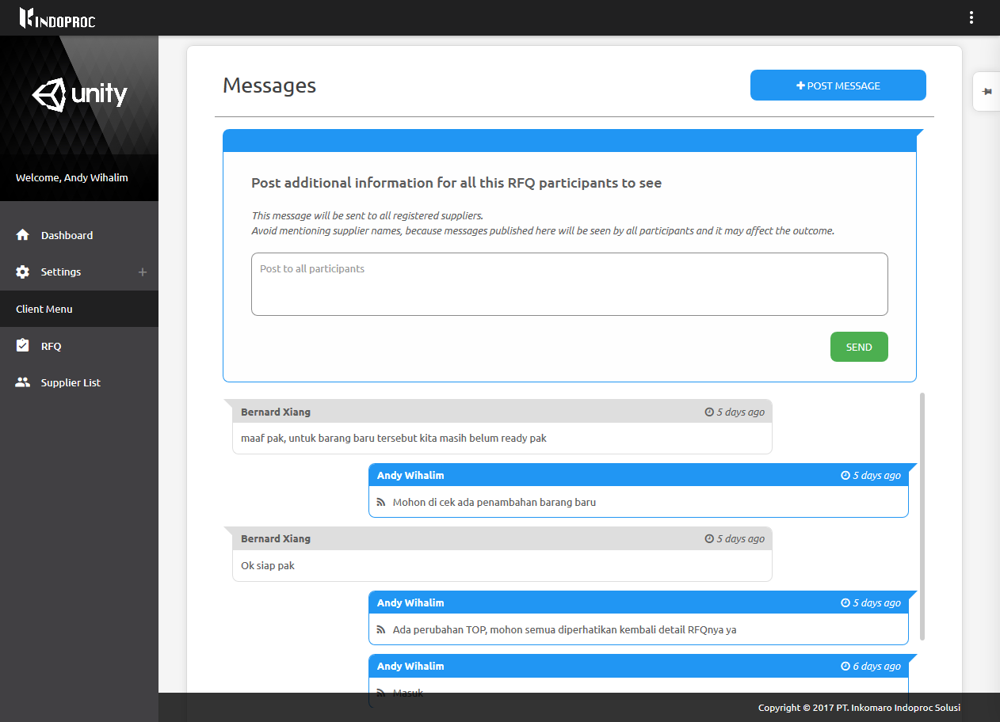

.. _rfq:

RFQ (Request For Quotation)
===========================

Request for Quotation (RFQ) page can be accessed when you have client privilege.

Create a RFQ
------------

- To create RFQ you need to open the `RFQ Page <http://indoproc.com/esourcing/rfq>`_: , and click the "Create RFQ Button"

  .. image:: ../img_src/createrfqbtn.png
      :width: 400px
      :alt: Login Section
	  
- In the 'Create RFQ' page, there are 3 section that you have to fill the required information:

  - RFQ Detail form:
  
   .. image:: ../img_src/section1rfq.png
    :width: 800px
    :alt: Login Section
	
   - RFQ title: The RFQ Title.
   - Due date: The RFQ due date; a deadline for supplier to submit thair quotation.
   - Delivery date: (Not necessary) the estimated time when the winner supplier have to deliver the requested items.
   - Category: Choose the RFQ category
   - Location: Choose the RFQ location
   - Type: Choose the RFQ type:
    
	- Public RFQ: this RFQ can be accessed by public and all registered supplier can submit their quotation.
	- Private RFQ: this RFQ can be accessed by the invited supplier only.
	
   - Description: The RFQ description.
   
  - Items list:
  
   .. image:: ../img_src/section2rfq.png
    :width: 800px
    :alt: Login Section
   
   - this section will show your required item(s).
   
   - to add item, click the 'add item' button and the add item sidebar will be showed up.
   
   .. image:: ../img_src/additem.png
     :width: 600px
     :alt: Login Section  
   
   - input the detail such as Item name, item specification, quantity, uom, target price. You can also add the attachment file.
  
  - Invited Supplier list:
  
   .. image:: ../img_src/section3rfq.png
    :width: 800px
    :alt: Login Section
  
   - This section will show your invited supplier.
   - The invited supplier will recieve the notfication email about your RFQ.
   - If you choose Public at the RFQ type, you can leave this section blank;
   - but if you choose Private at the RFQ type, invite the supplier is a must.
   
   - To invite the supplier, click 'add Supplier' button and the add supplier sidebar will be showed up.
      
   .. image:: ../img_src/addsuprfq.png
     :width: 600px
     :alt: Login Section  
   
   - You can filter the suppler list by their company's category.
   - You can choose more than 1 supplier into your RFQ invitation.
   - Click 'Add to supplier list' button to add them.
 
  -  Click 'Send' button to create your RFQ. 
	 
View submitted RFQ list
-----------------------

Public RFQ and Private RFQ list can be accesed from the RFQ menu. The RFQ List is divided into 5 tabs according to it's current status:

- All : No filter, this tab will show all of your submited RFQ(s).
- Open : This tab will show the current active RFQ(s) (Still accepting for quotation). You can still invite supplier into this RFQ or do an update.
- Closed : This tab will show the RFQ(s) that exceeded the due date (Not accepting the quotation anymore). Client should have to decide the winner (supplier).
- Cancelled : This tab will show the canceled RFQ(s).
- Completed : This tab will show the completed RFQ(s) (the RFQ is closed and the winner has been decided).

You can also filter this RFQ with Start Date, End Date, Title or Description, RFQ Type and Category for each RFQ list.

	  
To view or edit the RFQ detail, you can click the "View" button, you can also resend the invitation email to the supplier.

To compare the submitted quotation(s) for a RFQ, click the "Compare" button, you can choose the winner supplier from the compare page.

RFQ Detail
----------

In RFQ detail page you can review and edit the current active RFQ.

There are 4 section in this page:

- RFQ Detail, display the Overview of the RFQ, also include Charts that displays the current statistic information.
- Items, hidden by default, you can press the chevron icon to display the content. This section displays the items that needed in this RFQ.
- Quotation and invitations displays the list of submitted quotation and the list of supplier invitation.
- Message board, you can send message directly to all member who present in this RFQ.

Message board
-------------

Direct communication between the client and the suppler is now possible with this feature.

To create message, just click 'Post message' button, input your message and click send.

Please note that your message can directly read by all members, so please makse sure you didn't post any ci=onfidential information in this message board.

