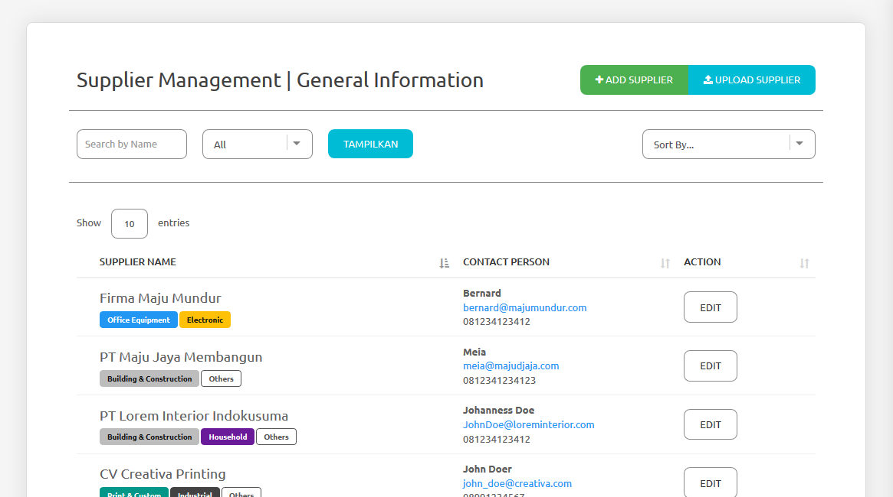

.. _supplier_list:

Supplier List
=============

You can add your own supplier list into this website for invite them to your created RFQ later. To add or view your supplier list, you can click 'Supplier List' menu.

- There are list of your supplier that will be shown in this page. It will show supplier name, category, contact person, phone and email of that supplier.
- You can filter the supplier by its name and by category that applied to them.
- You can also sort the supplier by its name or contact person alphabetically.

Create New Supplier
-------------------

 .. image:: ../img_src/supup.png
     :width: 430px
     :alt: Login Section

 - Click "Add Supplier" button on the top right of this page.
 
 .. image:: ../img_src/supedit.png
    :width: 600px
    :alt: Login Section
 
 - Side panel will be opened and you could input the company type, company name, Locations, category, contact person, email and phone.
 - Then you can click "Save" button to save the supplier. 
 
Edit/Update Supplier
--------------------
 
 .. image:: ../img_src/supedit.png
    :width: 600px
    :alt: Login Section
 
 - You can click "Edit" button on the row you want to edit.
 - Side panel will be opened and you can change the company data in there.
 - Then you can click "Save" button to save the supplier.
 
Import Your Supplier List
-------------------------

 .. image:: ../img_src/supup.png
    :width: 430px
    :alt: Login Section

 - You can click on "Upload Supplier" on the top right of the page.
 - Side panel will be opened and click "Download Excel" to download excel template for supplier data.
 - Inside the excel template:
 
  - There are 19 columns in excel file (Supplier Type, Supplier Name, Contact Person, Email, Phone, 8 categories and 5 locations).
  - On the second line, there are options for supplier type and category. You can copy the second row to third row and so on, so you have the same options for them.
  - Please remember to fill supplier name, contact person, email and phone.

 - After you filled the excel, click on "Upload Excel" to upload your excel file to our server.
 - Our server will automatically, insert the data to your supplier database and the result will be show after the process finished.