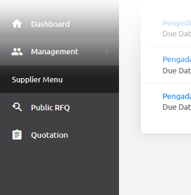

.. _public_rfq:

Public RFQ
==========

Public RFQ can be accessed by public.

Finding Public RFQ
------------------

You can find/view the public RFQ from these options:

Before Login
************
 
Public RFQ can be viewed before login, but to join or create the quotation login/register is a must.
 
- Login Page

  .. image:: ../img_src/pubrfq_ss.png
    :width: 700px
    :alt: role select
  
 - Public RFQ showed at the left section of the login page
 - Please note that only 5 top RFQ's will be shown.
 - To view more public RFQ list, you can click the 'View More' Button to Open Public RFQ Page
 - These are the actions you can do:
  
  .. image:: ../img_src/rfqact1_ss.png
    :width: 600px
    :alt: role select  
	
  1. View top 5 Latest RFQ

   You can view the top 5 latest RFQ by clicking the 'Newest Request' Button

  2. View top 5 Highest RFQ Estimated Price

   You can view the top 5 highest RFQ price by clicking the 'Highest Request' Button
   
  3. View details of the public RFQ

   .. image:: ../img_src/detailrfq_ss.png
     :width: 700px
     :alt: role select
   
   - You can view the details of the Public RFQ by clicking the public RFQ title or click the 'View Detail' button
   
   
  4. Join RFQ
  
   You can join the RFQ after you login/register, so you'll be automatically redirected to the register page after clicking the 'Join' button
  
- Public RFQ Page:
  
  .. image:: ../img_src/pubrfqlist_ss.png
      :width: 700px
      :alt: role select

 - Public RFQ Page can be accessed by clicking 'View More' button at the login page, or click this link
 - These are the actions you can do:
  
  1. Filtering the Public RFQ List
  
   .. image:: ../img_src/filter_ss.png
     :width: 600px
     :alt: role select
  
   - You can filter the Public RFQ list by enter the due date and/or the client company (who created the RFQ) name
   - Click 'Show' button
  
  2. Sorting the RFQ List
  
   .. image:: ../img_src/pubsort_ss.png
     :width: 600px
     :alt: role select
   
   You can sort the Public RFQ list by choosing the type of sort:
   
   - Amount (from highest or lowest)
   - Posted Date (from latest or oldest)
   - Company Name (ascending or descending)
   
  3. View details of the public RFQ
  
   .. image:: ../img_src/detailrfq_ss.png
     :width: 700px
     :alt: role select

   You can view the details of the Public RFQ by clicking the public RFQ title
   
  4. Join RFQ
  
   You can join the RFQ after you login/register, so you'll be automatically redirected to the register page.
  
After Login
***********

Public RFQ also can be accessed on Public RFQ menu after login.

