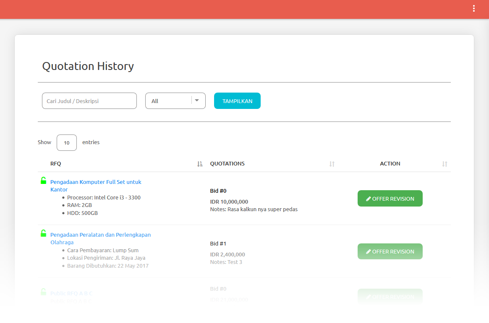

.. _public_rfq_status:

Check Quotation Status
======================

View Submitted Quotation
------------------------

list of your submitted quotation can be accessed from the quotation history menu.

- You can filter your quotation list by input your quotation title/description or choose by these categories:
  
 - All: show all of your quotation
 - In Progress: show your currently active quotation and you can still offer revision (instruction below)
 - Success: show your success bid/quotation
 - Unsuccess: show your unsuccess bid/quotation

Send Revision
-------------
  
You still can offer a quotation revision if the RFQ still open.

- Click 'Revise' button from your submitted quotation list

 .. image:: ../img_src/offer-ss.png
    :width: 700px
    :alt: role select

- you'll be redirected to quotation submit page

 .. image:: ../img_src/submit_ss.png
    :width: 700px
    :alt: role select

- input your new bid price (the unit price will be automatically calculated)
- you can upload your support files/attachment for each item (format file supported: \*.png, \*.gif, \*.jpg, \*.jpeg, \*.doc, \*.docx, \*.xls, \*.xlsx, \*.pdf)
- you can add notes to the quotation plus, you can upload your support files/attachment
- Click 'Submit Quotation'